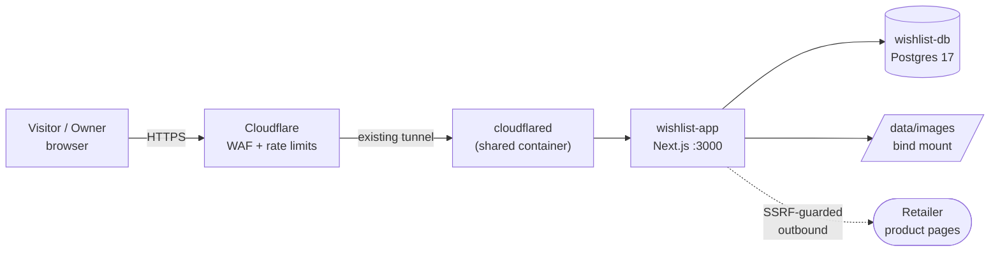

# Architecture

## System



No inbound ports are opened on the router. The app's hostname is added as a public hostname on an
existing Cloudflare Tunnel — `cloudflared` gets bridged onto the `wishlist_default` network and
routes to `http://wishlist-app:3000`. The public origin comes from `APP_URL`; nothing in the repo
hardcodes a domain.

## Internal boundary

One container, two worlds, separated by directory:

```
src/
  app/              Next routes, React components, client state
    (auth)/         login, register
    w/[slug]/       the single list page
    api/            Route Handlers — thin: validate, call service, serialize
  server/
    db/             Drizzle schema + migrations
    services/       domain logic (wishlists, items, claims, auth)
    og/             scraper, parser, image pipeline
    net/            safe-fetch (SSRF guard)
    auth/           JWT signing, session helpers
  lib/              shared pure utils, types, i18n
```

**`src/app/` never imports Drizzle or touches the DB.** Route Handlers validate input with Zod
and delegate to `src/server/services/`. This is what lets FE and BE context stay separable —
it's the whole reason the split exists. See [ADR-0001](../adr/0001-nextjs-fullstack.md).

## Why Next.js full-stack

The product is *sharing links*. A shared list URL must render as a rich card in WhatsApp, which
means server-rendered OG tags on `/w/[slug]`. A client-only SPA can't do that without a prerender
hack — and building an app about OG cards that has no OG cards would be silly.

One container also means one deploy on a box that already runs four stacks.

## Data flow: adding an item

1. `POST /api/preview { url }` — authenticated, so the SSRF surface is not public
2. `safe-fetch` validates the URL: scheme, DNS resolution, IP denylist, then pins the socket
3. Parse `<head>` → `og:*`, `twitter:*`, JSON-LD `schema.org/Product`
4. Cache the result by URL hash (`og_cache`) so re-pastes are free
5. Return prefill JSON to the client
6. On save, download `og:image` through the same guard → `sharp` → 800px webp → `data/images/{item_id}.webp`
7. Row stores `image_path` *and* `source_image_url` (kept so a manual refresh stays trivial)

Images are stored, not hotlinked — see [ADR-0004](../adr/0004-store-images.md) for why the
cron-refresh alternative was rejected.

## Deployment

```
<deploy-dir>/
  docker-compose.yml
  .env                  # chmod 600, never in git
  data/
    images/             # bind → /app/data/images
    postgres/
```

All services use `restart: unless-stopped` so the stack comes back on its own after a reboot.

**A dedicated Postgres container.** Don't reuse a Postgres instance belonging to another
self-hosted service — those are often extension-tuned with their own backup and upgrade cycles,
and sharing one couples two unrelated services in ways that complicate both.

## Operational notes

- **Not backed up — deliberately.** This is a hobby project and its data is reconstructable:
  items can be re-added from their URLs. Treat the database as expendable; don't build features
  that assume durable history.
- **Outbound scraping leaves via the host's own IP**, not the tunnel — tunnels carry inbound
  traffic only. On a self-hosted box that usually means a residential connection, so avoid
  anything resembling bulk crawling that could get the address rate-limited. This is one of the
  reasons scheduled re-scraping was rejected in [ADR-0004](../adr/0004-store-images.md).
- **Uptime is best-effort.** Self-hosted hardware fails; `restart: unless-stopped` plus a host
  watchdog covers reboots, but with no backups a corrupted database means starting the data over.

## Dependency policy

Adding a runtime dependency needs a line in the ADR or task explaining why. Current intended set:

`next` · `react` · `drizzle-orm` · `postgres` · `zod` · `jose` (JWT) · `@node-rs/argon2` ·
`sharp` · `nanoid` · `cheerio` (OG parsing) · `tailwindcss`
