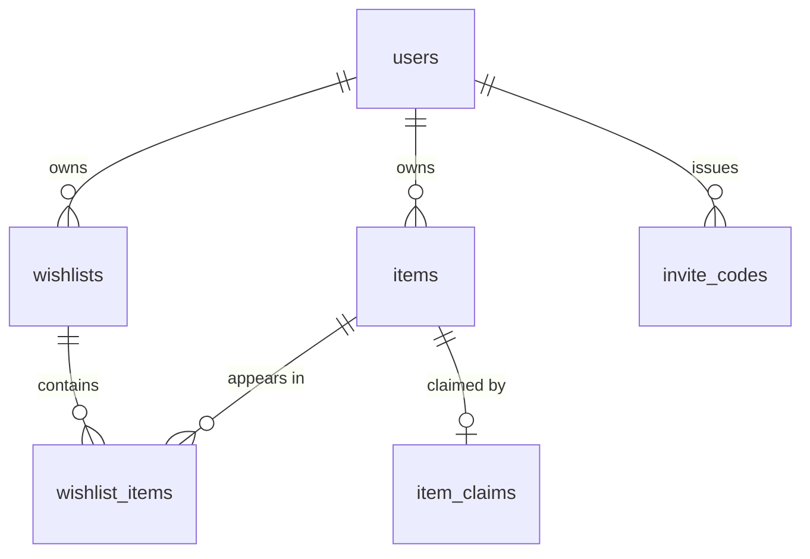

# Data Model

Canonical schema lives in `src/server/db/schema.ts` (Drizzle). This doc explains the *why* —
the invariants that aren't visible in column definitions.

## Tables

### `users`
`id` uuid pk · `email` citext unique · `password_hash` · `display_name` · timestamps

Argon2id for hashing. Email is `citext` so casing never causes a duplicate account.

### `invite_codes`
`code` pk · `created_by` → users · `used_by` → users null · `used_at` · `expires_at` · `created_at`

Single-use. Registration is invite-gated because the site sits on a public URL.

### `wishlists`
`id` uuid pk · `owner_id` → users · `title` · `slug` unique · `is_default` bool ·
`hide_claims_from_owner` bool default **true** · timestamps

- `slug` is a 10-char nanoid, not the UUID. Shorter to share, and it keeps the primary key out
  of URLs. **Possession of the slug is the permission** — there's no other access check on the
  public view.
- Partial unique index on `(owner_id) WHERE is_default` — exactly one default list per user,
  enforced by the database rather than application code.
- The default list can be renamed but not deleted.

### `items`
`id` uuid pk · `owner_id` → users · `url` · `title` · `notes` · `image_path` ·
`source_image_url` · `site_name` · `price_amount` numeric(14,2) · `price_currency` char(3) ·
`price_usd_snapshot` numeric(14,2) · `fx_rate_used` numeric(14,6) · `og_status` ·
`og_fetched_at` · `deleted_at` · timestamps

- **Scoped to their owner.** Two users pasting the same MercadoLibre link get two independent
  rows. Bought state must never leak between users — this is the reason items aren't global.
- **Soft delete** via `deleted_at`. An item may already be claimed; hard-deleting would destroy
  the claim record and make an accidental delete unrecoverable. Every query filters
  `deleted_at IS NULL`.
- `og_status` ∈ `pending | ok | failed | manual`. `failed` is a normal outcome, not an error —
  roughly half of retailers block server-side scraping.
- `image_path` is a bare filename (`{item_id}.webp`) resolved against the images directory.
  `source_image_url` is kept alongside it so a manual re-fetch stays a one-liner.

### `wishlist_items`
pk `(wishlist_id, item_id)` · `position` int · `added_at`

The many-to-many join. Hard delete — removing an item from a list is not destructive.

### `item_claims`
`id` uuid pk · `item_id` → items **unique** · `claimed_by_user_id` → users null ·
`claim_token` · `claimed_at`

- The unique constraint on `item_id` enforces one active claim per item at the database level.
  Don't try to do this with a read-then-write in application code — it races.
- Claims attach to the **item**, not to `wishlist_items`. One physical gift, bought once, shows
  as bought everywhere it appears.
- `claim_token` is an opaque random string returned to the claimer and stored in their
  localStorage. It's what lets an anonymous visitor undo their own claim. Without it, one
  misclick locks an item permanently.

### `og_cache`
`url_hash` pk (sha256 of normalized URL) · `payload` jsonb · `fetched_at`

Avoids re-scraping a URL that was pasted recently. Also blunts abuse of `/api/preview`.

### `rate_limits`
`key` pk · `tokens` double precision · `updated_at`

Token bucket in Postgres. No Redis — the volume doesn't justify another container, and
Cloudflare absorbs anything large before it reaches us.

`tokens` is a float rather than an integer so refill is continuous: a bucket gaining 0.011
tokens per second behaves smoothly instead of stepping once per interval.

Consumption is a **single atomic statement** (`INSERT ... ON CONFLICT DO UPDATE ... WHERE`).
A read-then-write lets concurrent requests all observe the last token and all take it — the
exact failure a rate limiter exists to prevent. The `WHERE` on the update also means a rejected
request leaves `updated_at` untouched; advancing it would restart the refill clock on every
retry and lock a hammering client out permanently rather than for the window.

Rows accumulate one per distinct key, so `pruneIdleBuckets` deletes buckets idle longer than
their window — safe because a fully-refilled bucket is indistinguishable from a fresh one.

## Money

Stored as `numeric(14,2)` plus an explicit ISO code. **Never a float.**

Cross-currency filtering is otherwise meaningless — "under 100" says nothing when a list mixes
COP and USD. So `price_usd_snapshot` is computed at write time from a configured FX rate, with
`fx_rate_used` recorded next to it. Filtering and sorting run on the snapshot; **display always
uses the original currency and amount.** The snapshot is explicitly a point-in-time approximation
and is never shown to users.

COP amounts are large (a 1.3M COP item) but well inside `numeric(14,2)`.

## Deletion semantics

These are easy to get subtly wrong, so they're spelled out:

| Action | Effect |
|---|---|
| Remove item from a list | Delete the `wishlist_items` row only |
| Remove item from its **last** list | Also soft-delete the item — nothing lands in orphan limbo |
| Delete item | Soft delete; claims survive; join rows removed |
| Delete wishlist | Prompt about items that live *only* in that list |
| Delete default wishlist | Blocked |

"Remove from this list" and "delete item" must look clearly different in the UI, or people will
destroy items they meant to unfile.

Editing an item's `url` re-triggers the OG fetch. Editing anything else does not. An item edited
after being claimed keeps its claim — worth a small UI note so a gift-giver isn't surprised by a
changed price.

## Image lifecycle

Stored files are only reachable through their item row, so orphans are possible after deletes.
A weekly sweep removes files in `data/images/` with no live referencing item. It runs locally
and makes **no outbound requests** — it is not a scraper.
